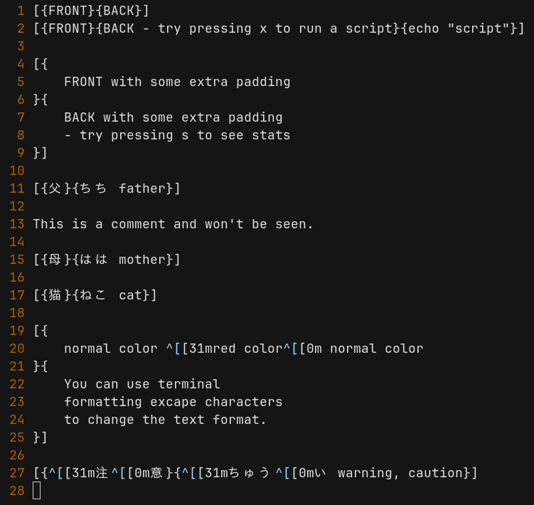
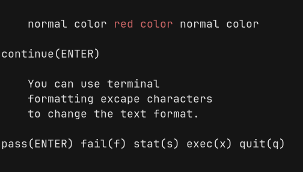

# meiki

[download](https://drive.google.com/uc?export=download&id=1OSKafAd2ydGoiWYugGWbU-DQ2zADMmGS) ver 2025-06-03 
*downloads project as a tar.gz file; plain-text instruction manual included 
*written in C; no dependencies

The project contains two separate but related tools. Both tools make use of the .meiki plain-text flashcard format.

**meiki** (pronounced: may key) is a simple terminal flashcard displaying tool.
- Use meiki if you want to study one or more .meiki decks at a time, shuffle cards randomly, select a subset of a deck(s), or just pick a random number of cards to study from a deck(s). Good for custom study sessions and full control.
- Optional scripts can be attached to each card and executed to play audio / video / open web links.

**danq** (pronounced: dawn Q) is a simple sane Spaced Repetition System (SRS) flashcard displaying tool using .meiki plain-text flashcard deck files to generate and update .danq plain-text SRS meta-data files.
- Use danq if you want to track your learning progress of .meiki deck(s). It saves your progress in .danq files.
- danq uses the [Leitner System](https://en.wikipedia.org/wiki/Leitner_system); putting you in full control of your study habits rather then being a slave to an automated SRS algothrim

## examples
> meiki deck1.meiki deck2.meiki deck3.meiki 
> meiki deck1.meiki -random 
> meiki deck1.meiki deck2.meiki -range50:200 -random 
> meiki deck1.meiki -random20 
> meiki deck1.meiki -range:50 -random25 

> danq -new deck1.meiki 
> danq deck1.meiki.danq -amount50 
> danq deck1.meiki.danq -rank2 -amount20 

An example.meiki plain-text deck file

A .meiki card in the terminal (front and back)

